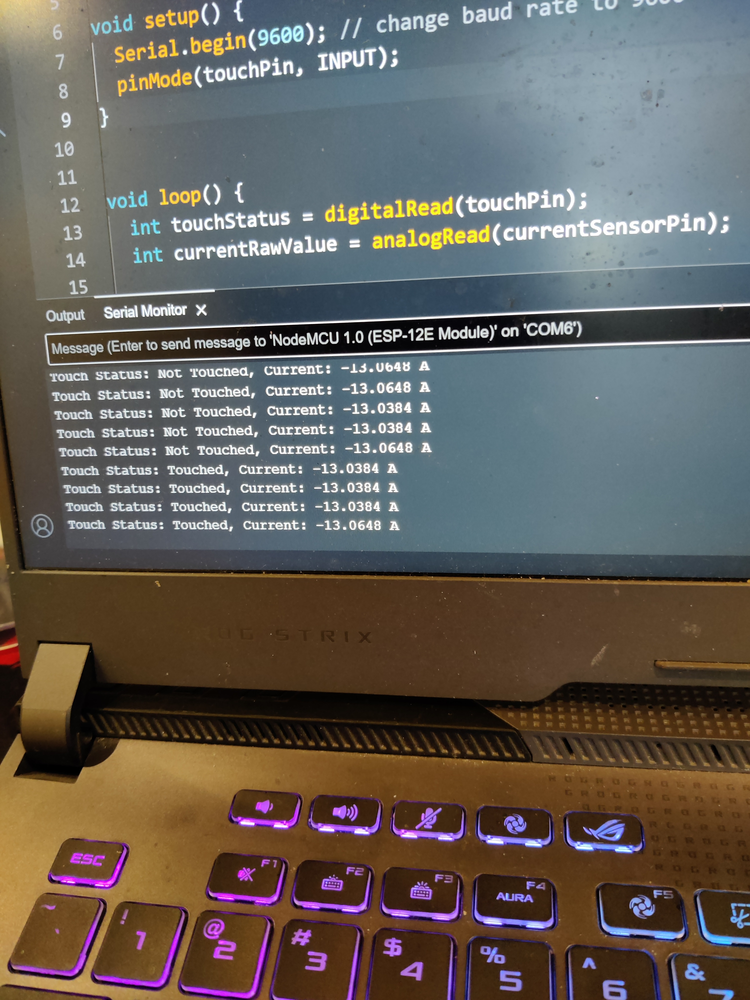

# Touch-Controlled Current Sensor 🔌👆

This is an IoT-based engineering project demonstrating a touch-activated current measurement system using NodeMCU (ESP8266), the ACS712 current sensor, and the TTP223 capacitive touch module.

---

## 📘 Abstract

This project integrates a capacitive touch sensor and a current sensor with a NodeMCU to allow users to measure current by simply touching the sensor. It demonstrates human-device interaction with current measurement, applicable in IoT and industrial monitoring environments.

---

## 🧰 Components Used

- NodeMCU (ESP8266)
- ACS712 Current Sensor (20A)
- TTP223 Capacitive Touch Sensor
- Jumper wires, breadboard
- Arduino IDE

---

## 🧪 Procedure (Summarized)

1. Connect the sensors to the NodeMCU as per the schematic.
2. Upload the code via Arduino IDE.
3. Open the Serial Monitor to see touch status and real-time current readings.

---

## 🔣 Arduino Code

```cpp
#include <Arduino.h>
const int touchPin = D2;
const int currentSensorPin = A0;

void setup() {
  Serial.begin(115200);
  pinMode(touchPin, INPUT);
}

void loop() {
  int touchStatus = digitalRead(touchPin);
  int currentRawValue = analogRead(currentSensorPin);
  float current = ((float)currentRawValue / 1024 * 5 - 2.5) / 0.185;
  
  Serial.print("Touch Status: ");
  Serial.print(touchStatus == HIGH ? "Touched" : "Not Touched");
  Serial.print(", Current: ");
  Serial.print(current, 4);
  Serial.println(" A");
  
  delay(500);
}

```  


🖼️ Project Setup Images
<br>

🔌 System Setup


<br>
🖥️ Serial Output 1

<br>

🖥️ Serial Output 2


<Br>
✋ Touch Sensor Wiring


📄 References
NodeMCU Docs
https://nodemcu.readthedocs.io/en/release/

ACS712 Datasheet
https://cdn.sparkfun.com/assets/4/a/a/0/8/ACS712.pdf

TTP223 Touch Sensor
https://www.electronicwings.com/nodemcu/ttp223-touch-sensor-interfacing-with-nodemcu

Arduino IDE
https://www.arduino.cc/en/software/

👨‍🎓 Author
<b> Yatin Vadehra </b>
B.Tech Electronics and Communication Engineering
The NorthCap University (2021–2025)

